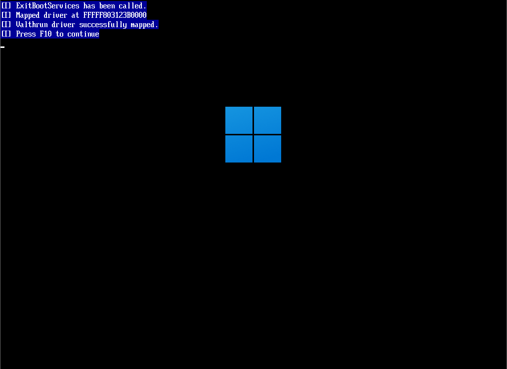

# Valthrun UEFI mapper
Automatically map the Valthrun driver from the UEFI.  
Doing this has several advantages:  
1. The Valthrun driver can be loaded before any other drivers
2. You can create a bootable USB stick containing the latest Valthrun driver

## Build the ISO
```ps1
cargo b --target x86_64-unknown-uefi && .\scripts\Create-ISO.ps1 -Destination ./bootloader.iso
```

## Load the valthrun driver
The valthrun driver should be automatically loaded when booting using the valthrun bootloader.  
To use the bootloader create a bootable USB stick and boot from that.  
On success you should see the following message:  
